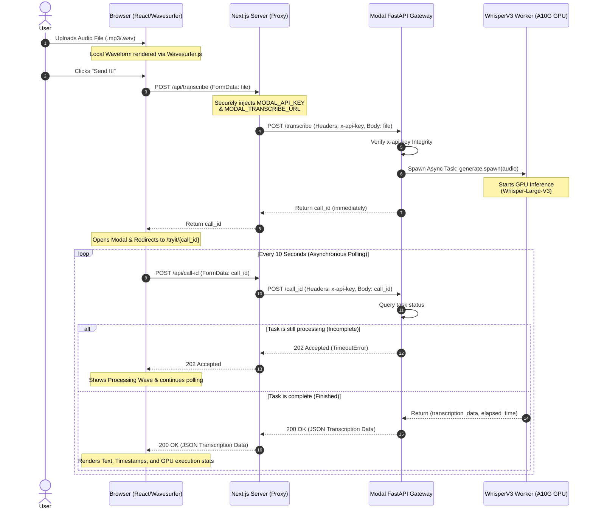

# Voxly — Enterprise Speech Intelligence at 5x Real-Time Speed

<p align="center">
  
</p>

<p align="center">
  <a href="https://nextjs.org"></a>
  <a href="https://bun.sh"></a>
  <a href="https://modal.com"></a>
  <a href="https://pytorch.org"></a>
  <a href="https://developer.nvidia.com/cuda-zone"></a>
  <a href="https://huggingface.co"></a>
</p>

---

**Voxly** is an ultra-fast, serverless, enterprise-grade audio transcription platform. It combines a beautiful, responsive Next.js 14 web client with a high-performance, auto-scaling backend deployed on **Modal.com** using NVIDIA A10G GPUs, **OpenAI's Whisper Large V3**, and **Flash Attention v2** optimization.

By deploying the inference engine onto on-demand serverless GPU containers, **Voxly** delivers sub-second cold starts, 5x real-time transcription speeds, and zero idle container costs—freeing you from the high fees and data-privacy constraints of third-party APIs.

---

## 🚀 Key Features

- ⚡ **Incredibly Fast Inference**: Transcribe hours of audio in minutes. Achieves up to **5x real-time speed** utilizing compiled **Flash Attention v2** inside CUDA-accelerated PyTorch containers.
- 🔄 **Asynchronous Polling Flow**: Designed to handle extremely large audio files (up to 50MB) without HTTP timeout errors. The client instantly receives a `call_id` and polls for results seamlessly.
- 🔒 **Secure Proxy Architecture**: The browser never talks directly to Modal. All requests are proxied via secure server-side Next.js API routes, keeping your Modal API Key and URLs completely hidden from client inspection.
- 📊 **Interactive Visual Waveform**: Powered by `wavesurfer.js`, the TryIt playground renders high-fidelity audio waveforms on the fly with responsive playback before submission.
- ⏱️ **Word & Chunk-level Timestamps**: Renders transcripts in multiple modes, including a clean paragraphs layout, interactive timestamps (showing exact start/end markers in seconds), and raw high-fidelity JSON exports.
- 🖥️ **Modern Bento UI**: Beautifully responsive landing pages with glassmorphism components, dark/light modes, performance benchmarks, FAQ sections, and seamless Framer Motion transitions.

---

## 📐 System Architecture & Data Flow

**Voxly** is structured around a highly secure, serverless proxy architecture.

### 1. Secure Async Transcription Pipeline (Sequence Diagram)

This diagram illustrates how audio files are uploaded, handled asynchronously via a task-spawning pipeline to bypass HTTP timeout limits, and securely polled for results.



### 2. Tech Stack & Infrastructure Layer

The diagram below details the modular layers, dependencies, and environment isolations implemented across the repository:

```mermaid
graph TD
    subgraph Client
        ClientLabel["Presentation Layer Client-Side Browser"]
        UI[React 18 / Next.js SPA]
        Wave[Wavesurfer.js Waveform]
        Toast[Sonner Toast Notifications]
        Tabs[DataViewer Tabs: Text, Timestamps, JSON]
        ClientLabel --- UI
    end

    subgraph Proxy
        ProxyLabel["Proxy Security Layer Next.js Server"]
        TransProxy[POST /api/transcribe]
        PollProxy[POST /api/call-id]
        Env[Environment Variables: MODAL_API_KEY, MODAL_TRANSCRIBE_URL]
        ProxyLabel --- TransProxy
    end

    subgraph ModalInfra
        ModalLabel["Serverless Cloud Gateway Modal"]
        FastAPI[FastAPI Web App (ASGI)]
        FS[(Modal Network File System)]
        Secret[Modal Secret: transcribe-api-key]
        ModalLabel --- FastAPI
    end

    subgraph GPUWorker
        GPULabel["Machine Learning Engine GPU Container"]
        WhisperCls[Modal Cls: WhisperV3]
        CUDA[NVIDIA CUDA 12.1.0]
        Torch[PyTorch 2.5.1 + GPU]
        Model[Whisper Large V3 Model]
        FlashAttn[Flash Attention v2 Acceleration]
        GPULabel --- WhisperCls
    end

    %% Client and Proxy connections
    UI -->|Upload Audio File| TransProxy
    UI -->|Poll Call ID| PollProxy
    Env -.->|Securely Configures| TransProxy
    Env -.->|Securely Configures| PollProxy

    %% Proxy and Modal Gateway connections
    TransProxy -->|Proxied POST with API Key| FastAPI
    PollProxy -->|Proxied POST with API Key| FastAPI
    Secret -.->|Injects API_KEY Env| FastAPI

    %% Modal Gateway and Worker connections
    FastAPI -->|Async Spawn Job| WhisperCls
    FastAPI -->|Check Job Status| WhisperCls
    WhisperCls -.->|Uses| FS
    WhisperCls -.->|Inference Engine| Model
    Model -.->|CUDA Speedups| CUDA
    Model -.->|Tensor Framework| Torch
    Model -.->|Flash Attention 2| FlashAttn
```

---

## 💻 Tech Stack & Hardware Specs

### Frontend (Next.js 14)

- **Framework**: Next.js 14.2 (App Router, Server Actions & API Handlers)
- **Runtime**: Bun (Optimized package execution & fast dev cycles)
- **Styles**: Tailwind CSS + `tailwindcss-animate`
- **UI Primitives**: Radix UI (Dropdown, Tabs, Dialog) + Framer Motion
- **Icons & Notifications**: Lucide React + Sonner (Interactive Promise Toasts)
- **Audio Renders**: Wavesurfer.js 7.7 (Client-side Canvas WebAudio rendering)

### Backend & Machine Learning (Modal)

- **Platform**: Modal.com (Serverless Python execution context)
- **Framework**: FastAPI 0.110 (Asgi application gateway on Modal)
- **GPU Hardware**: **NVIDIA A10G (24GB VRAM)**
- **Docker Base**: `nvidia/cuda:12.1.0-cudnn8-devel-ubuntu22.04` running Python 3.11
- **Base Frameworks**: PyTorch 2.5.1 (cu121) & Hugging Face Transformers
- **Model**: OpenAI's Whisper Large V3 (`openai/whisper-large-v3`)
- **Accelerations**: Flash Attention v2, SafeTensors integration, `hf-transfer` utility (high-speed snapshot downloads)

---

## 📂 Project Directory Structure

```directory
├── app/                        # Next.js 14 App Router Page Tree
│   ├── api/                    # Server-Side Secure API Handlers
│   │   ├── call-id/            # Route to query Modal task completion
│   │   │   └── route.ts
│   │   └── transcribe/         # Route to upload file & fetch task UUID
│   │       └── route.ts
│   ├── tryit/                  # Playgrounds & Live Data Viewers
│   │   ├── [call_id]/          # Dynamic page displaying transcription results
│   │   │   └── page.tsx
│   │   └── page.tsx            # Main try-it dashboard & drag-and-drop
│   ├── globals.css             # Main styling, mesh gradient styling
│   ├── layout.tsx              # Main layout & dark mode wrapper
│   └── page.tsx                # Main corporate landing / SaaS home
├── components/                 # Reusable React components
│   ├── ui/                     # Shadcn / Radix Primitive styling
│   ├── codehost/               # Interactive deployment tabs
│   ├── audioSubmit.tsx         # Handlers for POST uploading & modal status
│   ├── data-viewer.tsx         # Renders Text/Timestamp/JSON tabs & GPU speed
│   ├── HeroDemoPreview.tsx     # Animated mock components of playground
│   └── waveform.tsx            # Wavesurfer waveform rendering client context
├── lib/                        # Client-side helpers, hooks & utils
│   ├── hooks/                  # Clipboard copier and local stores
│   └── utils.ts                # Tailwind merge and utility mappings
├── modal/                      # Python serverless backend directory
│   └── modal_app.py            # Whisper model loader and FastAPI endpoints
├── package.json                # Project configuration & Node metadata
└── bun.lockb                   # Bun lock file
```

---

## 🛠️ Step-by-Step Installation & Setup Guide

Ensure you have the following prerequisites installed locally:

- [Bun](https://bun.sh/) (or NPM / Yarn)
- [Python 3.11](https://www.python.org/)
- A [Modal](https://modal.com/) account (Free tier includes $30/month GPU credits!)

### 1. Backend Setup & Deploying to Modal

1. **Clone the Repository**:

   ```bash
   git clone https://github.com/yourusername/Voxly.git
   cd Voxly
   ```

2. **Initialize a Virtual Environment**:

   ```bash
   python3 -m venv whisperenv
   source whisperenv/bin/activate
   ```

3. **Install Modal & FastAPI locally**:

   ```bash
   pip install modal==0.62.181 fastapi==0.110.0
   ```

4. **Connect Modal to your Terminal**:
   Log in with the browser dashboard instructions:

   ```bash
   modal setup
   ```

   _(Alternatively, retrieve your API token IDs from the Dashboard and run `modal token set --token-id <token-id> --token-secret <token-secret>`)_

5. **Create your secure Secret API Key**:
   We need to configure a secret token shared between the Next.js proxy and the Modal FastAPI backend to prevent unauthorized access.
   - Generate a secure, random string (e.g. `openssl rand -hex 32`).
   - Create a Modal Secret named **`transcribe-api-key`**:
     - In the **Modal Dashboard**, navigate to **Secrets** -> **Create Secret** -> Select **Custom**.
     - Set **Secret Name** to: `transcribe-api-key`
     - Add a key-value pair:
       - **Key**: `API_KEY`
       - **Value**: _`<your-secure-api-key>`_ (Paste the random string generated above)

6. **Deploy the WhisperV3 backend**:

   ```bash
   cd modal
   modal deploy modal_app.py
   ```

   This launches the cold-start image creation. Modal compiles **Flash Attention v2**, downloads the 3GB **Whisper Large V3** snapshot securely, and sets up the auto-scaling ASGI FastAPI endpoint.
   Once completed, note down your live Modal App Endpoint URL (e.g., `https://yourusername--transcribe-x-entrypoint.modal.run`).

---

### 2. Frontend Configuration & Running Local Server

1. **Navigate back to the Project Root & Configure Env**:
   Create a `.env.local` file in the root folder:

   ```bash
   cd ..
   touch .env.local
   ```

   Open `.env.local` and add the following keys:

   ```env
   # Your deployed Modal app URL (No trailing slash)
   MODAL_TRANSCRIBE_URL=https://yourusername--transcribe-x-entrypoint.modal.run

   # The exact random API key you configured inside Modal Secrets
   MODAL_API_KEY=your-secure-api-key
   ```

2. **Install node modules**:

   ```bash
   bun install
   # or
   npm install
   ```

3. **Start the Local Development Server**:

   ```bash
   bun run dev
   # or
   npm run dev
   ```

4. **Launch the App**:
   Open [http://localhost:3000](http://localhost:3000) in your browser. Navigating to **Interactive Demo** takes you to the tryit page, fully ready to transcribe and visualize sample audios!

---

## 🔌 API Endpoints Documentation

### Frontend Proxied API (Client Browser $\leftrightarrow$ Next.js Server)

These endpoints are called by the browser client. They process requests securely and proxy them to Modal.

#### 1. POST `/api/transcribe`

- **Description**: Sends an audio file to be scheduled for serverless GPU transcription.
- **Request Format**: `multipart/form-data`
- **Body Parameters**:
  - `file`: The audio file binaries (e.g., `.mp3`, `.wav`, `.m4a` under 50MB).
- **Response (`200 OK`)**: Returns the immediate Modal call task ID.

  ```json
  "fc-01hs9vpy77yqp69qdf0w39y91a"
  ```

#### 2. POST `/api/call-id`

- **Description**: Queries the status of an ongoing transcription task.
- **Request Format**: `multipart/form-data`
- **Body Parameters**:
  - `call_id`: The unique Modal task call ID (e.g. `fc-01hs9vpy...`).
- **Response Options**:
  - **`202 Accepted`**: The task is still processing in the GPU pipeline.

    ```json
    ""
    ```

  - **`200 OK`**: The task is finished. Returns the transcription body and execution stats.

    ```json
    [
      {
        "text": " Hello world, this is a test audio file.",
        "chunks": [
          {
            "text": " Hello world, this is a test audio file.",
            "timestamp": [0.0, 3.42]
          }
        ]
      },
      1.428472948
    ]
    ```

---

### Backend Core API (Next.js Server $\leftrightarrow$ Modal Cloud)

These internal endpoints are exposed by the ASGI FastAPI app running on the serverless Modal cluster. They require an `x-api-key` header to authenticate requests.

| Endpoint      | Method | Header             | Content-Type          | Payload            | Description                                                                         |
| :------------ | :----- | :----------------- | :-------------------- | :----------------- | :---------------------------------------------------------------------------------- |
| `/transcribe` | `POST` | `x-api-key: <key>` | `multipart/form-data` | `file` (Binary)    | Spawns a Modal celery-like async task on GPUs, returning a `call_id` instantly.     |
| `/call_id`    | `POST` | `x-api-key: <key>` | `multipart/form-data` | `call_id` (String) | Performs a 0-timeout check on the task. Returns `202` on timeout, `200` on payload. |
| `/stats`      | `GET`  | `x-api-key: <key>` | `None`                | `None`             | Retrieves active queue lengths, active run-instances, and cold-starts telemetry.    |

---

## 🔒 Security Design Pattern

```
+------------------+                   +------------------+                   +------------------+
|  Client Browser  |                   |  Next.js Server  |                   |  Modal Backend   |
|                  |                   |                  |                   |                  |
|  - Renders UI    |                   |  - Environment   |                   |  - Secure GPU    |
|  - Plays Audio   |  POST /api/...    |    Isolations    |   POST /trans..   |    Container     |
|  - Renders Wave  +------------------>|  - Injects Key   +------------------>|  - Validates Key |
|  - No API Keys   |                   |  - Hides URL     | (x-api-key header)|  - High-Speed ML |
|  - Safe Console  |                   |                  |                   |                  |
+------------------+                   +------------------+                   +------------------+
```

By utilizing server-side proxy handlers (`app/api/transcribe` and `app/api/call-id`), **Voxly** isolates credentials:

1. **API Key Protection**: The sensitive `MODAL_API_KEY` is saved solely as a production environment variable. It never gets compiled into frontend client bundles or visible in browser request headers.
2. **Origin Concealment**: Client requests are bound to relative host paths `/api/transcribe`, completely concealing the backend deployment endpoint URL `https://*.modal.run` from code inspection.
3. **CORS Restriction**: The Modal FastAPI application is locked down to specific origin domains (`http://localhost:3000` or production hosts) to prevent unauthorized external requests.

---

## 🤝 Contributing

We welcome contributions to Voxly! To propose features, bug fixes, or performance enhancements:

1. Fork this repository.
2. Create a branch for your feature: `git checkout -b feature/amazing-feature`.
3. Commit your modifications: `git commit -m 'feat: Add some amazing-feature'`.
4. Push your branch: `git push origin feature/amazing-feature`.
5. Submit a Pull Request.

---

## 📄 License

This project is licensed under the MIT License - see the [LICENSE](./LICENSE) file for details.

---

## 💖 Acknowledgments

- [Modal](https://modal.com/) for making high-performance cloud GPUs incredibly accessible and easy to deploy.
- [Hugging Face Hub](https://huggingface.co/) and OpenAI for releasing the state-of-the-art **Whisper-Large-V3** model.
- [Wavesurfer.js](https://wavesurfer-js.org/) for the excellent, fast, and feature-rich visual audio waves.
- The open-source communities behind PyTorch, FastAPI, and Next.js.

---
